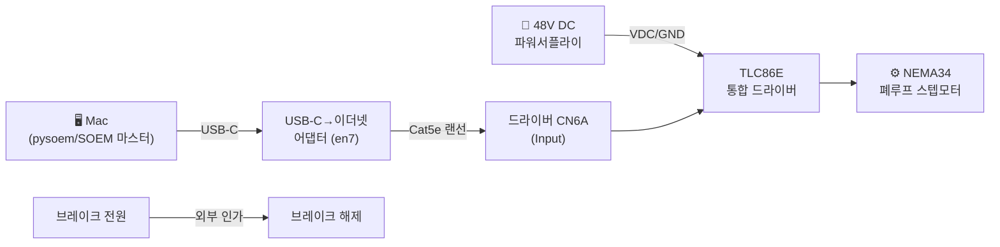
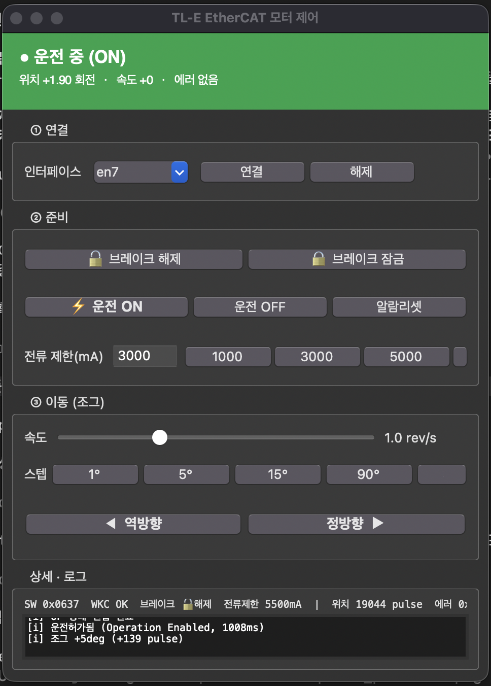

# TLC86E EtherCAT 스텝모터 구동 보고서

> **목표:** Lichuan **TLC86E-48V-8.5** (NEMA34 통합형 폐루프 스텝모터, EtherCAT 버전)를 **맥(Mac)** 에서 직접 구동하고, 제어용 GUI 앱을 제작한다.
>
> **작성일:** 2026-07-08 · **결과:** ✅ 다중회전 정/역 구동 성공, GUI 앱 완성

---

## 1. 한 줄 요약

"랜선만 꽂으면 되나?"에서 출발해서 → **맥을 EtherCAT 마스터로 만들고(pysoem/SOEM)** → CiA402 프로토콜로 모터를 정/역 다중회전으로 구동하는 **GUI 앱**까지 완성했다. 도중의 폭주·폴트 미스터리는 전부 **실측 디버깅**으로 원인을 규명했다(범인은 브레이크 미해제).

---

## 2. 핵심 결론 먼저

| 질문 | 답 |
|---|---|
| 랜선만 꽂으면 도나? | ❌ 아니오. EtherCAT은 일반 이더넷이 아니라 **마스터**가 필요 |
| 맥으로 되나? | ✅ 된다. **pysoem(SOEM) + USB-C 이더넷 어댑터 + Free-Run 모드** |
| 왜 Enable이 안 됐나? | 폐루프 서보온에 **~1초** 걸림 → 상태워드 폴링으로 해결 |
| 왜 폭주/폴트가 났나? | **브레이크가 완전히 안 풀려서** 고가속 시 폐루프 정류 상실 → 폭주 → 위치편차 폴트 |
| 전류·전압 실시간으로 볼 수 있나? | ❌ 이 드라이버 펌웨어가 노출 안 함 (CiA402 6078/6079 미구현) |

---

## 3. 시스템 구성



| 구성요소 | 내용 |
|---|---|
| 마스터 | 맥 + **pysoem 1.1.13** (SOEM 파이썬 래퍼), Free-Run(비동기) 모드 |
| 물리 연결 | 맥 USB-C → 이더넷 어댑터(`en7`) → 랜선 → 드라이버 **CN6A(Input)** |
| 전원 | 48V DC → VDC/GND (86모델 권장 48V) |
| 브레이크 | 무여자 작동형(전원 넣어야 풀림). 외부 전압으로 수동 해제 |
| 프로토콜 | CoE (CANopen over EtherCAT), **CiA402** 드라이브 프로파일, PP 모드 |

> ⚠️ macOS는 raw 이더넷 접근에 관리자 권한 필요: `sudo` 실행 또는 `sudo chmod o+rw /dev/bpf*` (장치 권한이라 앱 단위 지정 불가)

---

## 4. 드라이버 식별 (실측)

| 항목 | 값 |
|---|---|
| 이름 | `EtherCAT Driver` |
| ManufacturerID | `0xA79` |
| ProductCode | `0x3100` |
| 운전모드(2301h) | `2` = **폐루프(closed-loop)** |
| 회전당 펄스(2302h) | `10000` |
| 지원모드(6502h) | `0xA5` = PP·PV·HM·CSP |
| 피크전류(2303h) | `5500 mA` |

---

## 5. 디버깅 여정 & 핵심 발견

### 5-1. 연결 확인 ✅
슬레이브 스캔 성공, 식별정보·에러코드 정상. **1600h/1A00h PDO 재매핑을 드라이버가 수용**함을 확인.
- **RxPDO** = [6040 제어워드(U16), 607A 목표위치(I32), 6081 속도(U32)]
- **TxPDO** = [6041 상태워드(U16), 6064 실제위치(I32), 606C 실제속도(I32)]

### 5-2. Enable이 ~1초 걸리는 문제 🔑
`0x06→0x07→0x0F` 시퀀스를 보내도 **바로 운전허가가 안 됨.** 측정 결과:

```
0x0F 유지 → ENA 비트는 약 1009ms 후에 켜짐
```

**원인:** 폐루프 스텝모터가 enable 시 **로터/엔코더 전기각 정렬 + 브레이크 시퀀스**를 수행하는 데 ~1초 소요. 조절 파라미터 아님(230Ah 등 바꿔도 안 변함 — 실측 확인).
**해결:** 고정 딜레이가 아니라 **상태워드의 ENA(bit2)가 켜질 때까지 폴링** (표준 CiA402 방식).

### 5-3. 이동 시 폭주(runaway) 미스터리 🔑🔑
가장 어려웠던 부분. `+2500`펄스 이동을 명령했는데:

```
목표 +2500 → 엔코더가 반대로: 1892 → -616 → -5733 → ... → -22916 (2.3바퀴 폭주)
→ 0xFF05(위치편차, following error) 폴트
```

여러 가설을 **실측으로 하나씩 배제**:
- 방향(2300h) 반전? → 저속에선 양방향 정상. 방향 문제 아님 ❌
- 고속 불안정? → +500 이동은 전 속도 정상 ❌
- 가속(6083) 문제? → 브레이크 열고 나니 가속 200000에서도 정상 ❌

**진짜 원인 = 브레이크 미해제.** 브레이크가 완전히 안 풀린 상태에서 고가속 출발 → 로터가 브레이크 저항에 끌려 뒤처짐 → **폐루프 정류(commutation) 상실 → 반대로 폭주 → 위치편차 폴트.**
**브레이크를 완전히 열자 전 속도/가속에서 완벽 동작.**

### 5-4. 구동 성공 ✅
브레이크 완전 개방 후 데모:

```
✅ +2바퀴  ✅ -2바퀴   ✅ +3바퀴  ✅ -3바퀴   ✅ +5바퀴  ✅ -5바퀴
전부 목표 오차 ~25펄스 내 완주 · 폭주/폴트 0 · 속도 1.2 rev/s
```

---

## 6. 전류·전압 실시간 모니터링 조사 (결론: 불가)

"전압·전류를 실시간 그래프로 보고 싶다"는 요청에 대해 심층 조사한 결과:

- **드라이버 전체 OD(오브젝트 사전) 110개를 통째로 읽음** (SDO Information 서비스) → 전압/전류/온도 **실측 오브젝트 없음**
- CiA402 표준 진단 오브젝트를 직접 프로빙:
  - `6078h Current actual` → **미구현(무응답)**
  - `6079h DC link voltage` → **미구현(무응답)**
  - `6077h Torque actual` → 슬롯만 있고 값이 **−196 상수로 방치**(스터브)
- **컨벤션(CiA402)** 에는 6078/6079가 정의돼 있으나, **이 스텝 드라이버 펌웨어가 생략**. 리추안 서보 라인(LC10E/A6)은 구현하지만 통합 스텝 라인은 뺌 (LinuxCNC 커뮤니티도 동일 확인).

**→ 소프트웨어로는 못 뽑음. 진짜 V/I는 48V 라인에 외부 센서(INA226 등) 필요.**

### 과전류 보호는 어떻게 도나?
드라이버는 전류를 **내부적으로 측정한다**(OD에 전류루프 게인 2700~2703h 존재 = 측정 증거). 과전류 시 **하드웨어 비교기 고속트립 + 펌웨어가 `603F=0xFF01` 폴트 래치 + 토크 차단.** 단 **측정값은 노출 안 하고 "폴트 결과"만** 밖으로 준다(퓨즈처럼).

---

## 7. 제작한 GUI 앱



### 실행 방법
```bash
# 방법 1: Finder에서 run.command 더블클릭
# 방법 2: 터미널
sudo /Library/Frameworks/Python.framework/Versions/3.13/bin/python3 \
     /Users/hojunsong/Desktop/Ethercat/tlc_ethercat_gui.py
```
> raw 이더넷 접근 때문에 **sudo 필수**

### 기능
- **큰 상태 배너** (색으로 즉시 인지): 회색=미연결 / 파랑=대기 / **초록=운전중** / **빨강=폴트**
- **① 연결** — `en7` 기본, 연결/해제
- **② 준비** — 브레이크 해제/잠금, 운전 ON/OFF, 알람리셋, **전류 제한(mA)**
- **③ 이동(조그)** — 속도 슬라이더(rev/s), 스텝 프리셋(1/5/15/90/360°), 큰 정/역 버튼
- **폴트 자동 감지·경고** — 과전류 등 폴트 시 배너 빨강 + 로그 경고
- **Enable 폴링** — 운전허가 확인까지 대기(폐루프 ~1초 대응)

### 사용 순서
```
연결 → 브레이크 해제 → 운전 ON(⚡) → 스텝 크기 선택 → 정방향/역방향
```

---

## 8. 기술 레퍼런스

### CiA402 상태 전이 (실측 상태워드)
| 상태 | StatusWord | 의미 |
|---|---|---|
| Ready to switch on | `0x0231` | 대기 |
| Switched on | `0x0233` | 스위치온 |
| **Operation enabled** | `0x0237` | **운전허가(토크 인가)** |
| Fault | `0x0208` | 폴트 |

### 제어 시퀀스
```
Enable : 0x80(폴트리셋) → 0x06 → 0x07 → 0x0F, 그 후 ENA(bit2) 켜질 때까지 폴링(~1초)
이동   : 목표위치 세팅 → 0x0F → 0x1F(bit4 상승엣지, 절대) 또는 0x5F(상대)
폴트   : 0x80 → 0x00 후 재-Enable
```

### 에러코드 (603Fh)
| 코드 | 의미 |
|---|---|
| `0x0000` | 정상 |
| `0xFF01` | 과전류 |
| `0xFF02` | 과전압 |
| `0xFF03` | 저전압 |
| `0xFF04` | 상 오류 |
| `0xFF05` | 위치편차(following error) |

---

## 9. 파일 목록

| 파일 | 용도 |
|---|---|
| `tlc_ethercat_gui.py` | **메인 GUI 앱** |
| `run.command` | 더블클릭 실행기 |
| `scan.py` | 연결/식별 확인 |
| `e2e.py` / `demo.py` | 구동 테스트/데모 |
| `od_dump.py` | 전체 오브젝트 사전 덤프 |
| 각종 debug_*.py | 디버깅 스크립트 (enable/폭주/전류 규명) |

---

## 10. 배운 것 / 주의사항

1. **EtherCAT ≠ 랜선.** 반드시 마스터(SW 포함) 필요. 맥은 pysoem으로 가능(Free-Run).
2. **폐루프 스텝 Enable은 ~1초.** 고정 대기 말고 **상태워드 폴링**.
3. **이동 전 브레이크 완전 해제 필수.** 미해제 시 고가속에서 폭주/폴트.
4. **추측 금지, 실측.** 폭주 원인을 가설별로 값 찍어가며 배제한 게 결정적이었음.
5. **이 드라이버는 전류/전압 텔레메트리 없음.** 필요하면 외부 센서.
6. macOS raw 이더넷 = `sudo` 또는 bpf 권한 개방 필요.
