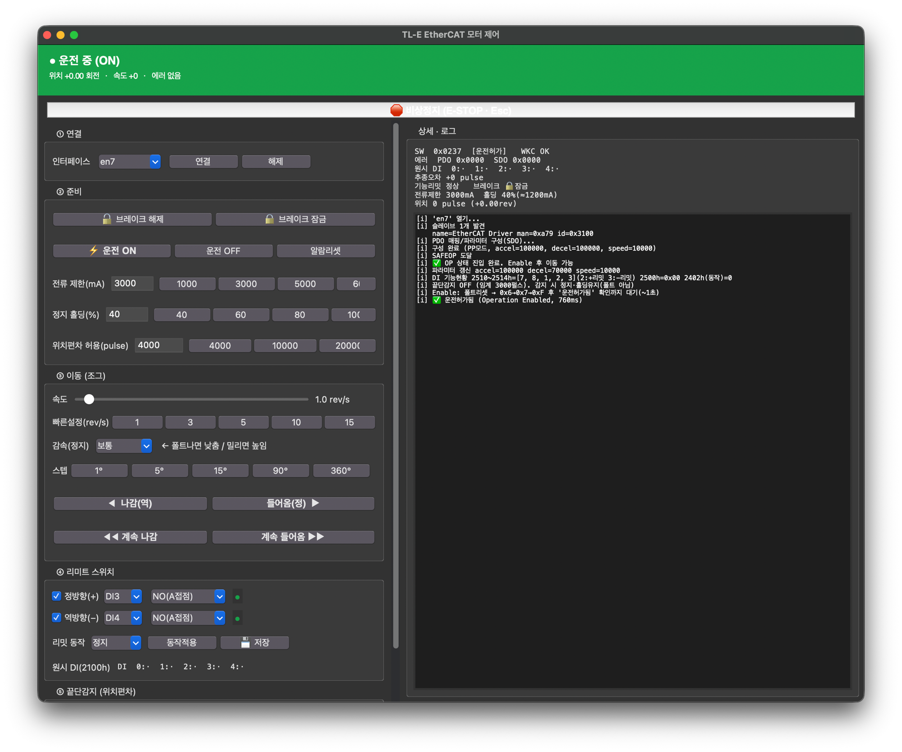

# TLC86E EtherCAT — 리미트/브레이크/앱 고도화 (Day 2)

> **작성일:** 2026-07-09 · **범위:** 리니어 액추에이터 적용, 끝단 감지 방식 결정, GUI 앱 대폭 개선
> **전제:** Day 1(2026-07-08)에서 맥+pysoem으로 정/역 구동 및 기본 GUI 완성 → [2026-07-08.md](2026-07-08.md)

---

## 1. 한 줄 요약

모터를 **리니어 액추에이터(수직, ~100kg 하중)**에 붙여 테스트. 리미트용 근접센서(Omron E2B)를 달려다 **알루미늄·짧은 감지거리로 부적합** 판명 → **리미트 스위치·브레이크 둘 다 안 쓰고**, **위치편차(추종오차)로 끝단을 소프트 감지**하는 방향으로 결정. 앱에 진단·안전 기능을 대폭 추가.

---

## 2. 핵심 결론 먼저

| 질문 | 답 |
|---|---|
| 브레이크 쓰나? | ❌ **안 씀.** 전원 켜져 있으면 홀딩전류(500mA/40%)로 100kg 유지됨 |
| 근데 안전한가? | ⚠️ **전원/Enable 끊기면 떨어짐**(백드라이브 축, OFF 시 낙하 실측). 비상정지·정전 시 낙하 주의 |
| 리미트 스위치 쓰나? | ❌ **안 씀.** E2B(유도형)는 알루미늄 감지 거의 불가 + 1mm 거리라 부적합 |
| 끝단 감지는? | ✅ **위치편차(60F4h) 소프트 감지 → Halt(홀딩유지)**. 폴트(0xFF05, 토크차단=낙하) 나기 전에 잡음 |
| 알람이 왜 0000이었나? | 리밋/정지류는 603F 코드가 없음(0000 정상). 진짜 폴트만 0xFF01~05 |

---

## 3. 하드웨어/센서 검토 결과

### 3.1 근접센서 Omron E2B-S08KS01-WP-B1 → 부적합
- 스펙(검색 확정): **PNP · NO · 3선 · 10~30VDC**, M8, **감지 1mm**
- 배선: 갈색=+24V, 파랑=0V, 검정=신호→DIx, **DICOM=0V**(PNP는 common cathode)
- 표시등은 **감지 시에만** 켜짐(전원만으론 안 켜짐)
- **문제:** 타깃이 **알루미늄** → 유도형 감지거리 철의 ~0.3배 → 사실상 접촉. + 1mm 정격은 움직이는 축엔 너무 짧음
- **결론:** 이 센서로는 불가. 실사용하려면 광전/정전용량/factor-1 유도형/기계식이 필요 → 하지만 최종적으로 **센서 자체를 안 쓰기로 함**

### 3.2 브레이크 → 안 씀
- 전류제한 500mA + 홀딩 40%(≈200mA)로 **100kg 유지 확인**. 10mA에선 내려옴(백드라이브 축)
- **운전 OFF 시 낙하 실측** → 무전원 유지 불가
- 결정: 브레이크 미사용. 대신 **비상정지/정전 시 낙하 위험 인지**하고 운용

### 3.3 끝단 감지 = 위치편차(소프트)
- 하드스톱에 밀어붙이면 추종오차(60F4h)가 커짐 → 임계 넘으면 **앱이 Halt(홀딩유지)**
- **폴트(0xFF05)를 쓰지 않는 이유:** 폴트=토크차단=100kg 낙하. 그래서 폴트 전에 소프트로 잡음
- 230Dh(폴트 임계)는 그 위 백스톱

---

## 4. 앱(GUI) 오늘 추가/변경

| 구분 | 내용 |
|---|---|
| **에러코드 표시 수정** | 603F/60FD를 **TxPDO 매핑**(SDO 폴링이 0으로 남던 버그). SDO 교차확인·상태워드 비트 디코드 추가 |
| **🛑 비상정지** | 항상 보이는 빨강 버튼 + Esc. 즉시 토크차단(조그 중에도 즉시) |
| **속도** | 최대 3→**25 rev/s**, 빠른설정 버튼 |
| **연속 조그** | 누르는 동안 이동, 떼면 감속정지 |
| **방향 라벨** | 나감(역=−)/들어옴(정=+) 명시 |
| **감속(정지) 조절** | 부드럽/보통/빠름 (급감속 회생폴트 완화). 가속은 firm 유지(밀림 방지) |
| **위치편차 임계(230Dh)** | ② 준비에서 설정 |
| **끝단감지(위치편차)** | ⑤ 패널 — 사용/임계, 추종오차 실시간, 감지 시 Halt·홀딩유지 |
| **원시 DI(2100h)** | 배선 진단용 실시간 표시 |
| **2컬럼 레이아웃** | 좌(컨트롤·스크롤) / 우(로그), **가운데 경계 드래그로 폭 조절** |

### 참고 — DI/리미트 관련 OD (안 쓰지만 기록)
`2510h~2514h`(DI0~4 기능, 2:+리밋 3:−리밋) · `2500h`(NO/NC) · `2100h`(원시 DI) · `60FDh`(기능상태) · `2402h`(리밋동작) · `60F4h`(추종오차) · `230Dh`(편차 임계) · `2201h`(저장)

---

## 5. 미해결 / 다음 할 일

- 끝단감지 실측 튜닝: 임계값(기본 3000펄스)과 속도 조합 → 오검출/미검출 없이 잡히는지
- 낙하 안전: 비상정지를 "감속정지+홀딩유지"로 바꿀지 결정(단, 정전엔 무효)
- 원점(홈) 설정: 한쪽 끝단 감지 후 그 위치를 0으로 잡는 기능(선택)
